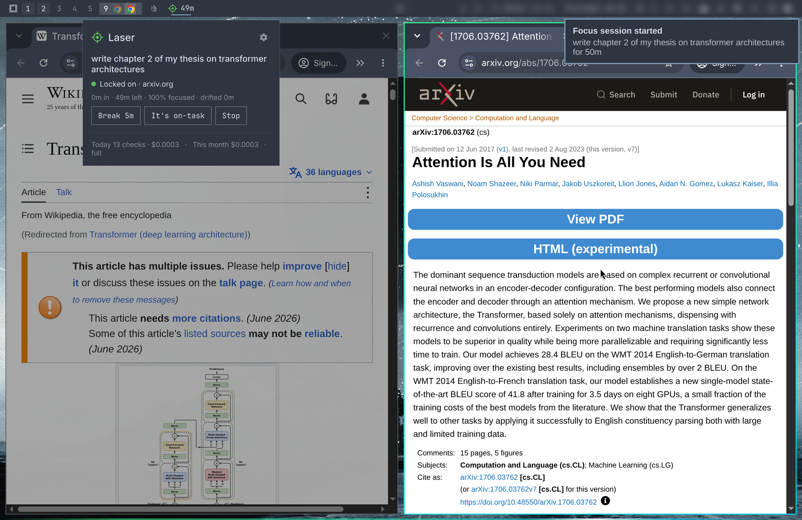
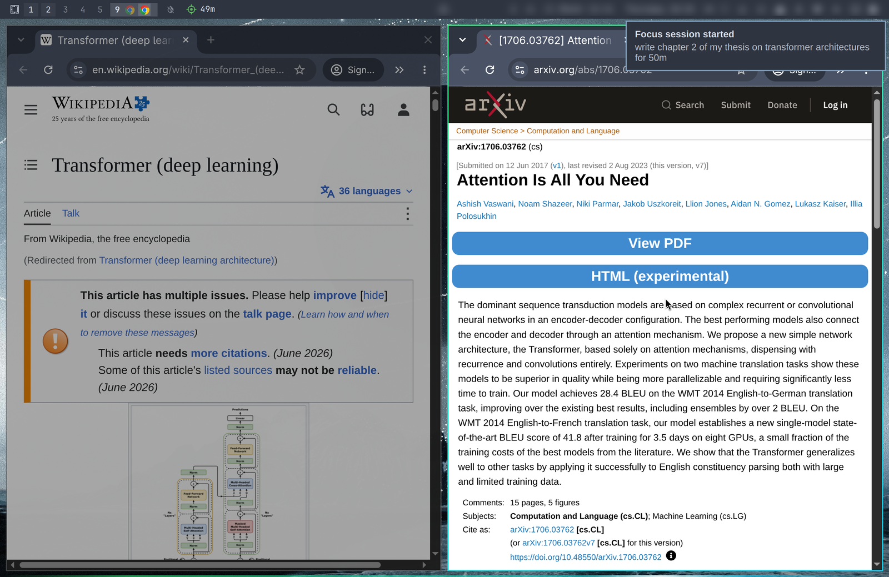
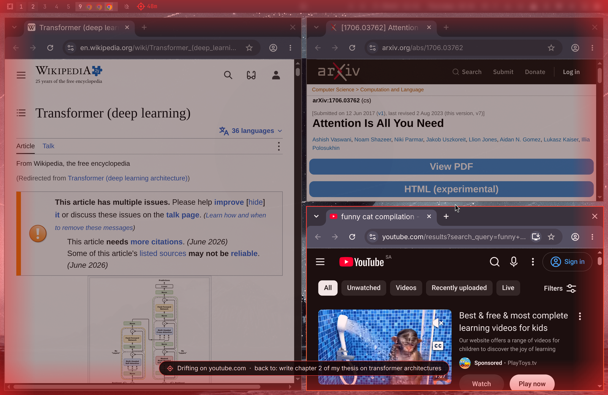
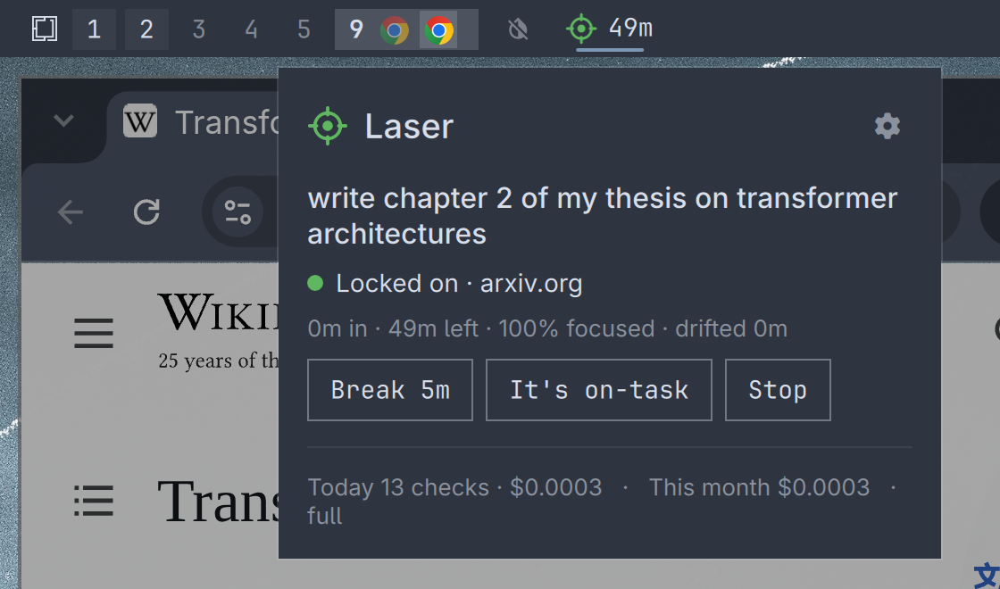
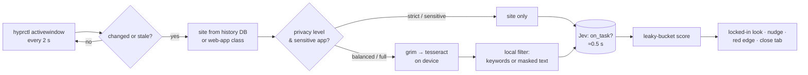

<div align="center">


# Laser: AI focus mode for Omarchy

**Tell it what you're working on. It notices when you drift and pulls you back.**

An AI distraction blocker for [Omarchy](https://omarchy.org) and Hyprland on Linux. It judges
each screen against *your* task, not a blocklist, it's private by design, and it costs about a cent a day.

[](https://omarchyplugins.com)
[](#install)
[](#how-it-works)
[](#privacy)
[](LICENSE)



</div>

---

## Why Laser

You sit down to work and twenty minutes later you're in a WhatsApp thread or deep in Reddit,
and you can't say how you got there. Classic site blockers don't fit how people actually work:

- **Blocklists are blunt.** Reddit is a distraction until you need r/MachineLearning for your
  thesis, and WhatsApp is noise until you're replying to clients.
- **Timers don't notice anything.** A Pomodoro clock can't tell research from rabbit holes.
- **Willpower runs out,** especially with ADHD.

Laser judges every screen **in the context of the task you declared**. Each check takes about half
a second and costs a fraction of a cent, through [TypeSafe's Jev](https://docs.typesafe.ai), a fast
classification model. When you drift it escalates gently, from a red dot to a nudge to a red screen
edge, and only then closes the tab. While you're on task, the whole screen shows it: you're locked in.

| You declared | On screen | Laser says |
|---|---|---|
| *write chapter 2 of my thesis on transformers* | arXiv: *Attention Is All You Need* | 🟢 on task (98%) |
| same | r/MachineLearning: *transformer attention* search | 🟢 on task (82%) |
| same | r/memes | 🔴 drifting (1%) |
| same | WhatsApp | 🔴 drifting |
| *reply to my clients about invoices* | WhatsApp | 🟢 on task |
| *research GPU prices for a workstation* | Amazon: *rtx 5090* | 🟢 on task (97%) |

## See it

| Locked in | Drifting |
|---|---|
|  |  |
| The window you're working in glows; everything else fades back. | Two minutes off task: a red edge pulls you back to the task. |



## Features

- **🎯 Task-aware AI judging.** Every screen is checked against your own words, so the same site can be work in one session and a distraction in the next.
- **🔒 Locked-in mode.** While you focus, your active window's border glows laser green, everything else dims, and a beam sweeps the bottom of the screen. It turns red the moment you drift, and your theme comes back when the session ends.
- **📈 Gentle escalation.** Red reticle at 30 s, a notification at 1 min, a pulsing red screen edge at 2 min, the tab closed at 4 min. Only browser tabs and web apps are ever closed, never native apps. *Strict* halves the timings; *Warn only* never closes anything.
- **🧠 Forgiving scoring.** A leaky bucket: real work pays back drift at twice the rate, so a glance doesn't reset you and a minute of work does.
- **✋ One-click "it's on-task".** Click the nudge (or right-click the reticle) and that site counts as work for the rest of the session.
- **🕵️ Privacy levels.** Strict, Balanced or Full. Chats, email, banking and password managers are always site-only, and screenshots never leave your machine. [Details](#privacy)
- **💸 Bring your own key.** Your TypeSafe key, roughly **$0.30–0.50 a month** of daily use, with live cost in the panel. [Details](#cost)
- **🧾 Auditable.** `laser audit` shows the exact JSON that was sent, every time.
- **🪶 Lightweight.** Python standard library only: no dependencies to install, no extra privileges. ~55 MB RAM, a few seconds of CPU an hour.
- **🧩 Native Omarchy plugin.** A Quickshell bar widget and panel that follow your theme, with IPC for keybindings and a CLI for everything.

## Install

From the Omarchy plugin marketplace, or directly:

```bash
omarchy plugin add https://github.com/iYassr/omarchy-laser --enable
```

That puts the reticle in your bar. Click it, open ⚙, paste your
[TypeSafe API key](https://typesafe.ai), and start a session.

**Requirements.** Omarchy (Quickshell shell) on Hyprland, `python3` (3.11+), `hyprctl` and
`notify-send` all ship with Omarchy. Balanced and Full privacy also need the `grim`, `tesseract` and
`tesseract-data-eng` packages for on-device OCR. Without them, Laser still works from site names.

**Optional CLI.** `ln -s ~/.config/omarchy/plugins/yasserdo.laser/bin/laser ~/.local/bin/laser`

### Remove

```bash
omarchy plugin remove yasserdo.laser
rm -rf ~/.config/laser ~/.local/share/laser ~/.local/state/laser   # settings, key, history, log
```

Stop any running session first (`laser stop`, or middle-click the reticle) so your window border returns
to your theme. If a `laser daemon` process is still running after removal, end it with
`pkill -f "laser daemon"` or log out and back in.

## Use

Click the reticle → type what you're working on → pick 25m / 50m / 90m / ∞ → **Enter**.

| In the bar | Action |
|---|---|
| click | open the panel: start, break, "it's on-task", stop, settings |
| right-click | the current site is on-task for this session |
| middle-click | stop the session |

```bash
laser start "write chapter 2 of my thesis" -m 50
laser status · laser stop · laser pause 10 · laser resume · laser allow
laser history                 # past sessions with focus %
laser usage                   # Jev checks, tokens and cost per day
laser audit                   # exactly what was sent to Jev
laser privacy strict|balanced|full
laser strictness gentle|strict|warn_only
laser look full|subtle|off
laser key                     # set your API key (hidden prompt or stdin)
```

Keybinding example (`~/.config/hypr/bindings.lua`):
`o.bind("SUPER + SHIFT + F", "Laser", "omarchy-shell laser-panel toggle")`

## Privacy

**Screenshots never leave your computer.** When Laser reads the screen, `grim` pipes the image
straight into `tesseract` on your machine and it is never written to disk. You choose how much
*text* goes to Jev:

| Level | Sent to Jev | Accuracy* |
|---|---|---|
| **Strict** | the site or app name only (`youtube.com`, `code`). The screen is never read | 11/14 |
| **Balanced** (default) | + common dictionary words from the title and screen. No sentences, names, numbers, emails, @handles or links | 12/14 |
| **Full** | + title, page path and ≤1200 characters of screen text, with emails, phone numbers, IBANs, IPs, links and secrets masked | 14/14 |

<sub>*Tested on 14 real pages. No level ever flagged real work as a distraction. Misses landed in "unsure", which carries no penalty.</sub>

At every level:

- **Chat, email, banking and password managers are always site-only,** and their screens are never
  read: WhatsApp, Telegram, Signal, Discord, Slack, Messenger, Teams, Gmail, Outlook, Proton Mail,
  PayPal, Wise, Revolut, 1Password, Bitwarden and KeePassXC. Add your own under `"sensitive"` in `~/.config/laser/settings.json`.
- **Names are filtered** with ~9,600 common first names and surnames (public-domain US Census data
  plus common Arabic, Asian and European names). That includes dictionary words that are also names.
- **Browser URLs** are looked up read-only in your local history database to label the site; query
  strings and fragments are dropped.
- **Unknown tabs stay private.** If a tab's site can't be identified (e.g. a private window), its screen
  is never read, and chat, mail or banking pages are also recognized by their title.
- **One known limit:** OCR reads the window's screen area, so a notification popped up over it is read too.
  Balanced keeps only dictionary keywords from it. Use Strict if that matters. See [SECURITY.md](SECURITY.md).
- **Nothing runs outside a session.** Laser checks nothing while idle, on a break, or while your screen is locked.
- **Fully auditable:** `laser audit` shows each payload. The local log keeps the last 200
  (`~/.local/share/laser/sent.jsonl`, readable only by you).
- TypeSafe [states](https://docs.typesafe.ai/legal) that it does not train on API inputs. Retention
  isn't fixed publicly, and zero retention is an enterprise option, which is why Laser minimizes what it sends.

## Cost

Jev charges **$0.042 per million input tokens**; output is free. A check is ~450 tokens of fixed
question schema plus your data (~40 strict, ~90 balanced, ~300 full). Laser only checks during a
session, when the window changes or a verdict goes stale (20 s when unsure, 60 s when clear):

| Your day | Checks / hour | 8-hour day (balanced) | Month (22 days) |
|---|---|---|---|
| calm, few switches | ~75 | $0.013 | ~$0.30 |
| typical | ~85 | $0.015 | ~$0.33 |
| scattered, constant switching | ~120 | $0.021 | ~$0.47 |

`laser usage` and the panel footer show your real numbers.

## How it works



| Module | Role |
|---|---|
| `laser/privacy.py` | builds every byte that is sent, per privacy level |
| `laser/engine.py` | pure state machine: scoring, escalation, breaks, timers |
| `laser/jev.py` | dependency-free API client (keep-alive, IPv4 fallback for broken IPv6) |
| `laser/sense.py` | focused window, tab URL lookup, on-device OCR, away detection |
| `laser/look.py` | locked-in border and dimming via runtime `hyprctl eval`, always restored |
| `laser/daemon.py` | loop, caching, control socket, usage and audit logs |
| `Service.qml` | supervises the daemon, draws the beam and the red edge |
| `BarWidget.qml`, `Panel.qml` | the reticle and the panel |

Tests: `python3 -m unittest discover -s tests`

## Security

Laser runs as your user with no extra privileges and talks to exactly one host (`api.typesafe.ai`)
over verified TLS. Its files are owner-only, your key goes over stdin and is verified before saving, and
web content is treated strictly as data. An end-to-end audit before release found 2 high, 3 medium and
5 low issues, and all are fixed. See [SECURITY.md](SECURITY.md) for the threat model, the findings and
private vulnerability reporting.

## FAQ

<details><summary><b>Does Laser send screenshots anywhere?</b></summary>

No. Images are OCR'd on your machine and never saved. Depending on the privacy level, Jev gets
the site name, a bag of keywords, or masked text. Run `laser audit` to see exactly what was sent.
</details>

<details><summary><b>Why does it need an API key? Is there a free option?</b></summary>

Laser uses TypeSafe's Jev model, and you bring your own key so there's no middleman or account with
us. Typical use costs $0.30–0.50 a month. Laser makes no calls outside focus sessions.
</details>

<details><summary><b>Will it close my work by mistake?</b></summary>

Closing only happens after four minutes of continuous drift (gentle mode), and only on the exact
browser tab or web app that was judged. Native apps such as editors, terminals, LibreOffice or GIMP are
never closed, because they may hold unsaved work. If you switched tabs at the last second, nothing is
closed. Choose *Warn only* to never close anything, and use "it's on-task" to correct a call.
</details>

<details><summary><b>Can I use Reddit, YouTube or WhatsApp for work?</b></summary>

Yes, that's the point. Describe your task and Laser judges the content against it. If it gets one
wrong, click the nudge and that site is allowed for the rest of the session.
</details>

<details><summary><b>What does "locked in" change on my screen?</b></summary>

During a focused session your active window's border glows green-cyan, other windows dim, and a thin
beam sweeps the bottom edge. Drifting turns the border red. It's all runtime-only. Your config files
are untouched and your theme's border comes back when the session ends. Pick *Subtle* or *Off* in ⚙.
</details>

<details><summary><b>Does it work with Firefox, Brave or Chromium?</b></summary>

Yes: Chrome, Chromium, Brave, Vivaldi, Edge, Firefox, LibreWolf and Zen. Browsers get a closed
tab rather than a closed window. Omarchy web apps (WhatsApp, Discord, …) are recognized by their site.
</details>

<details><summary><b>Does it work on a MacBook with a notch (Asahi)?</b></summary>

Yes. It was built on one. The reticle defaults to the left of the bar, away from the notch.
</details>

<details><summary><b>What happens when I lock the screen or walk away?</b></summary>

Laser pauses judging while the screen is locked or you're idle past the screensaver timeout, so
being away never counts as drift. Video playback keeps the session awake, so YouTube still counts.
</details>

<details><summary><b>Is this a replacement for Pomodoro?</b></summary>

It works alongside Pomodoro: sessions can be timed (25/50/90 min) and you can take breaks, but
Laser also knows *what* you were doing. `laser history` shows your focus percentage per session.
</details>

<details><summary><b>Is it ADHD-friendly?</b></summary>

That's who it was built for. It nudges instead of punishing: escalation is gradual, scoring is
forgiving, and one click overrides a wrong call.
</details>

## Contributing

Issues and pull requests are welcome. Please run the tests and keep the core stdlib-only. See
[SECURITY.md](SECURITY.md) for vulnerability reports.

## License

[MIT](LICENSE). The name list in `laser/names.txt` is derived from public-domain US Census data.

<sub>Keywords: Omarchy plugin, Hyprland focus mode, Linux distraction blocker, AI productivity tool,
ADHD focus app, website blocker for Linux, Quickshell widget, Arch Linux productivity, deep work timer,
privacy-first focus tracker.</sub>
